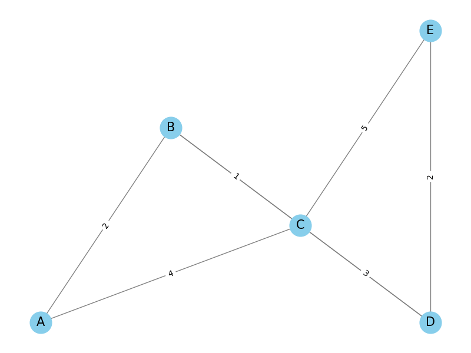

# goit-algo-hw-06

Homework 6. Basic Algorithms and Data Structures at GoIT Neoversity

# Graph Algorithms Comparison: DFS vs BFS

## Description
In this task, we compared two graph traversal algorithms: Depth-First Search (DFS) and Breadth-First Search (BFS). We used the transport network graph created in Task 1.

## Graph Creation
We created a graph representing a simple transport network using NetworkX. The graph includes nodes (stations) and edges (roads) with associated weights (distances).

## Graph Visualization


## Algorithms
1. **DFS (Depth-First Search)**: Explores as far as possible along each branch before backtracking.
2. **BFS (Breadth-First Search)**: Explores all neighbors at the present depth prior to moving on to nodes at the next depth level.

## Results

### DFS Path
```plaintext
[['A', 'B', 'D', 'E'], ['A', 'B', 'D', 'C', 'E'], ['A', 'B', 'C', 'E'], ['A', 'B', 'C', 'D', 'E'], ['A', 'C', 'E'], ['A', 'C', 'D', 'E'], ['A', 'C', 'B', 'D', 'E']]
```

### BFS Path
```plaintext
[['A', 'C', 'E'], ['A', 'C', 'D', 'E'], ['A', 'B', 'C', 'E'], ['A', 'B', 'D', 'E'], ['A', 'C', 'B', 'D', 'E'], ['A', 'B', 'C', 'D', 'E'], ['A', 'B', 'D', 'C', 'E']]
```

## Analysis

### Node and Edge Counts
```plaintext
Number of nodes: 5
Number of edges: 7
```

### Degree of each node
```plaintext
A: 2
B: 3
C: 4
D: 3
E: 2
```

## Conclusions
- **DFS**: The paths found by DFS are based on depth exploration, which might not yield the shortest path in terms of the number of edges. DFS can find multiple paths, and the order of discovery can vary based on the implementation.
  - DFS Paths: 
    - ['A', 'B', 'D', 'E']
    - ['A', 'B', 'D', 'C', 'E']
    - ['A', 'B', 'C', 'E']
    - ['A', 'B', 'C', 'D', 'E']
    - ['A', 'C', 'E']
    - ['A', 'C', 'D', 'E']
    - ['A', 'C', 'B', 'D', 'E']
  
- **BFS**: BFS guarantees finding the shortest path in terms of the number of edges by exploring nodes level by level. BFS also can find multiple paths, and the order can vary based on the implementation.
  - BFS Paths: 
    - ['A', 'C', 'E']
    - ['A', 'C', 'D', 'E']
    - ['A', 'B', 'C', 'E']
    - ['A', 'B', 'D', 'E']
    - ['A', 'C', 'B', 'D', 'E']
    - ['A', 'B', 'C', 'D', 'E']
    - ['A', 'B', 'D', 'C', 'E']

- In this specific graph, both algorithms found similar sets of paths, but the order and the specific paths differ. BFS found the shortest paths first due to its level-by-level exploration.

### Overall
BFS is generally preferred when the shortest path (in terms of the number of edges) is desired, while DFS can be useful for exploring complex, deeply nested structures where paths need to be explored exhaustively before backtracking.

## Test Environment
The results were obtained on a MacBook Pro 2021 with an Apple M1 Pro processor.